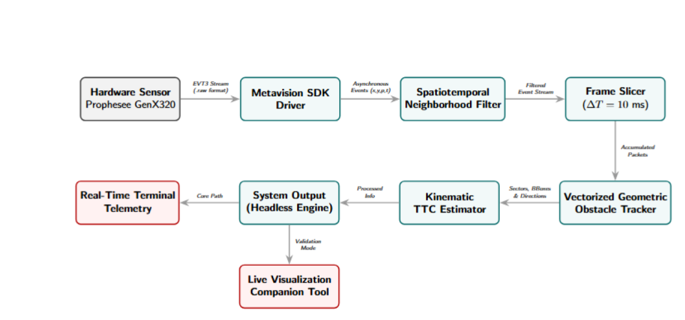

# Dynamic Vision Sensor Obstacle Avoidance: Looming Detection and Time-to-Collision on a Raspberry Pi 5

> **Course Project**: Dynamic Vision Sensors  
> **Authors**: [Paweł Jerzyna](https://github.com/pjerzyna), Piotr Grzyb, Marcin Dworak  
> **Method**: Event-based looming detection with kinematic TTC estimation, implemented from scratch in C++17 with ARM NEON SIMD

## 📌 Executive Summary / TL;DR

This repository delivers a bio-inspired optical avoidance system designed for resource-constrained edge hardware (Raspberry Pi 5) coupled with a neuromorphic event-based camera (Prophesee GenX320). This code for now is working only with recorded videos, launching it in real-time doesn't work. 

> **⚠️** Live camera capture on the Raspberry Pi 5 is not yet operational. The detection pipeline is validated offline. All benchmarks below were measured on real sensor recordings replayed on the target hardware. **⚠️**

Dense DNNs and Contrast Maximization saturate the CPU and desynchronization the event-stream on edge devices. Instead, this C++ pipeline mimics the looming detection and escape reflexes of flying insects. It extracts dynamic 2D bounding boxes via ARM NEON SIMD and evaluates a kinematic Time-to-Collision (TTC) surface expansion metric.

***TTC-based collision alerting - Prophesee GenX320 + Raspberry Pi 5***

### Key Benchmark Metrics

* ⚡ **Mean Core Latency**: **~0.13 ms** per 10 ms slice (1.3% of the single-core real-time budget).
* 🚀 **Real-Time Margin**: **82×** factor (26.6 s of events (7.14 M) processed in 350 ms CPU).
* 🛡️ **Zero Packet Loss**: **0%** slice deadline overruns; sustained deterministic 100 Hz output cadence.
* 💻 **CPU load**: Consumes **< 2%** single-core CPU load, leaving headroom for PX4 / ArduPilot integration.

📄 Performance metrics and analysis of computational and parametric complexity: **[docs/performance.md](docs/performance.md)**

## 🏗️ System Architecture & Data Pipeline

The pipeline processes asynchronous `EVT3` event streams $(x, y, p, t)$ through six decoupled C++ processing modules managed by a single `DetectionPipeline` engine.

## 📐 Mathematical Foundations

### 1. Spatiotemporal Neighborhood Filtering
To eliminate uncorrelated background thermal noise and hot pixels, each incoming event $e_i = (x_i, y_i, p_i, t_i)$ is evaluated against a 4-connected spatial neighborhood $\mathcal{N}(x_i, y_i)$ within a rolling 3 ms temporal deque:

$$\mathcal{N}(x_i, y_i) = \{(x_i \pm 1, y_i), (x_i, y_i \pm 1)\}$$

An event survives filtering if and only if:

$$\sum_{k \in \mathcal{N}(x_i, y_i)} \mathbb{I}(k) \ge N_{\text{min}} \quad (N_{\text{min}} = 1)$$

### 2. Vectorized Geometric Feature Tracking
Surviving events are mapped across three spatial sectors: Left ($x \le 106$), Central ($107 \le x \le 213$), and Right ($x \ge 214$). For the sector with maximum event count, spatial bounds ($x_{\text{min}}, x_{\text{max}}, y_{\text{min}}, y_{\text{max}}$) and arithmetic centroid $c(t)$ are calculated in a single pass parallelized via ARM NEON SIMD:

$$c(t) = \left( \frac{1}{n}\sum_{i=1}^{n} x_i, \; \frac{1}{n}\sum_{i=1}^{n} y_i \right), \quad \Delta c(t) = c(t) - c(t - 1)$$

### 3. Kinematic Time-to-Collision (TTC) Estimation
Rather than recovering explicit 3D metric depth, the system measures the optical footprint expansion rate ($\dot{A}_s = \Delta A_s / \Delta t$) of the 2D bounding box area $A_s(t) = w_s(t) \cdot h_s(t)$ over a 60 ms sliding window:

$$TTC_s(t) = \frac{A_s(t)}{\dot{A}_s} \quad \text{[seconds]}$$

A safety-critical collision alert is triggered whenever:

$$TTC_s(t) < \tau_{\text{danger}} \quad (\tau_{\text{danger}} = 0.45\text{ s})$$

## 📊 Performance Benchmarks

All figures below come from a single benchmark run on the artifacts committed
in [`docs/output/`](docs/output/) - recording `wykryty_ruch.raw`, 320 × 320,
7 143 802 events over 26.62 s, replayed on a Raspberry Pi 5.

### Per-stage execution latency

| Pipeline stage | Mean | p99 | Max | Scaling |
| :--- | :---: | :---: | :---: | :--- |
| **Spatiotemporal Filter** *(per SDK packet)* | **10.8 µs** | 30.1 µs | 4123 µs ⁽¹⁾ | $O(B + W \cdot H)$ - dominated by map rebuild |
| **Geometric Tracker** *(per 10 ms slice)* | **13.9 µs** | 89.3 µs | 1102 µs ⁽¹⁾ | $O(N)$ - 9.06 ns/event |
| **TTC Estimator** *(per slice)* | **0.76 µs** | 16.7 µs | 51 µs | $O(H_w)$ ≈ $O(1)$ - ≤ 7 samples |
| **Tracker + TTC** *(per slice)* | **14.7 µs** | 92.9 µs | 1102 µs | — |

⁽¹⁾ **The tail is environmental, not algorithmic.** Filter latency is
uncorrelated with packet size ($r = 0.03$), and the three largest outliers all
occur within the first 250 of 26 386 packets. Discarding a 500-packet warm-up
drops the filter maximum from 4123 µs to 533 µs while leaving the mean, median
and p99 unchanged. The tracker maximum occurs at N = 1940 events, not at the
largest slice (N = 26 121). Cold caches and OS scheduling, not workload.

### Aggregate throughput
| | Value |
| :--- | :---: |
| Total CPU time | **325 ms** for 26.62 s of events |
| Mean cost per 10 ms slice | **0.122 ms** *(= 324 832 µs / 2663 slices, filter + tracker + TTC)* |
| Real-time factor | **82×** |
| Throughput | **22.0 Mev/s** |
| Slice deadline overruns (> 10 ms) | **0.00%** (0 / 2663) |
| Single-core utilization | **1.22%** |
| Filter rejection rate | 27.6% (7.14 M → 5.17 M events) |
| Peak filter buffer / TTC history | 9830 events / 7 samples |

### Parameter sensitivity — `OA_FILTER_MIN_NEIGHBORS`

| Value | Filter rejection | Tracker mean | Slice p99 | Throughput | Detections | Danger slices |
| :---: | :---: | :---: | :---: | :---: | :---: | :---: |
| **1** *(default)* | 27.6% | 18.1 µs | 120.3 µs | 13.7 Mev/s | 2496 | 375 |
| 2 | 40.3% | 12.0 µs | 90.1 µs | 16.4 Mev/s | 2402 | 412 |
| 3 | 51.4% | 9.0 µs | 70.7 µs | 17.7 Mev/s | 2233 | 387 |

A more aggressive filter speeds up the tracker and tightens the latency tail at
the cost of detections. Throughput here is lower than in a clean single run.

## 🔮 Roadmap

Ordered by priority. Items marked 🔴 block the project's core claim; 🟡 improve
correctness or rigour; 🟢 extend capability.

### 🔴 Live capture on the GenX320

The processing pipeline sustains an 82× real-time margin on recorded streams, but the live path has never been brought up on Raspberry Pi 5 — until it is, every claim in this repository is an offline one. Requires diagnosing Metavision live-camera initialization, then re-measuring end-to-end latency including sensor I/O and USB transfer, which the current benchmark deliberately excludes.

### 🟡 Correctness and rigour

- [ ] **Fix the TTC constant.** Projected area scales as $Z^{-2}$, so
      $TTC = 2A/\dot{A}$, not $A/\dot{A}$ — the current formula reports half the
      true time-to-collision. Rescaling $\tau_{\text{danger}}$ from 0.45 s to
      0.90 s leaves behaviour bit-identical (verified: max TTC among expanding
      slices is 0.300 s, so both thresholds sit on the same plateau).
- [ ] **Make the TTC threshold meaningful.** The relative-growth gate bounds TTC
      at $T_w(1+\rho_{\min})/\rho_{\min} = 0.300$ s, so $\tau_{\text{danger}}$
      currently rejects nothing — `expanding` implies `danger` in 375/375 cases.
      Either lower it to ≈ 0.15–0.20 s or drop it and document the growth gates
      as the actual decision rule.
- [ ] **Alert hysteresis.** The `danger` flag averages **12 transitions per
      second**, with a median episode of a single 10 ms slice (88 of 160
      episodes last one slice). An N-of-M debounce or minimum alert duration is
      a prerequisite for any control-loop integration.
- [ ] **Labelled evaluation set.** No ground truth exists, so precision, recall
      and PR/ROC curves cannot be computed and no accuracy claim is currently
      defensible. `tools/param_sweep.py` already accepts a `--labels` file
      (`start_us,end_us`); it just needs the labels.
- [ ] **Validate beyond one recording.** Thresholds are tuned on a single
      26.6 s clip. Varying lighting, textures, approach angles and object sizes
      is needed before any generalization claim.

### 🟡 Performance

- [ ] **Eliminate the `build_map()` clear.** Zeroing the full 320×320 map every
      SDK packet costs ≈ 2.7 billion operations per run and dominates filter
      cost — packets average only 270 events. A timestamp-stamped map removes
      the clear entirely; results are unchanged.
- [ ] **Replace `FrameSlicer::pop_ready`'s `erase(begin())`.** `O(R)` per pop on
      a `std::vector` degrades to `O(R²)` when catching up on a backlog. A
      `std::deque` or a read index fixes it.
- [ ] **Benchmark warm-up.** Latency maxima are startup artifacts — discarding
      500 packets drops the filter maximum from 4123 µs to 533 µs with no change
      to mean, median or p99.

### 🟢 Capability

- [ ] **IMU fusion.** Ego-motion during banking and pitch produces global optical
      expansion indistinguishable from an approaching obstacle. Continuous-time
      gyro/accelerometer integration would cancel it and remove a whole class of
      false positives — the largest correctness gap for airborne use.
- [ ] **Multi-obstacle clustering.** Replace the single bounding box per sector
      with connected-component tracking, so scenes with several independent
      hazards are handled rather than collapsed into one box.
- [ ] **Closed-loop flight integration.** Bridge the decision engine to
      PX4 / ArduPilot over MAVLink, translating TTC warnings into evasive
      thrust vectors. Depends on live capture, hysteresis, and IMU fusion.

## 🙏 Acknowledggments
Special thanks to the Embedded Vision Systems Group at the AGH University of Krakow for providing hardware access, testing facilities, and research guidance throughout this project.